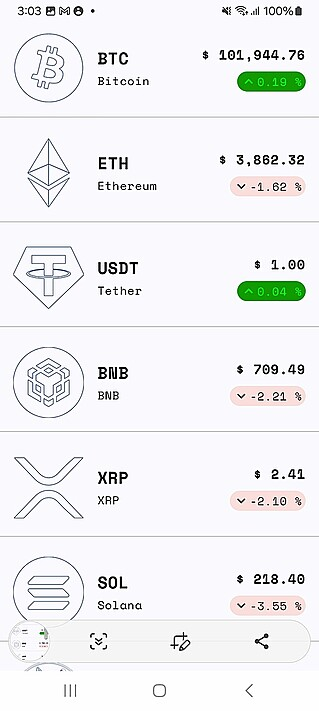
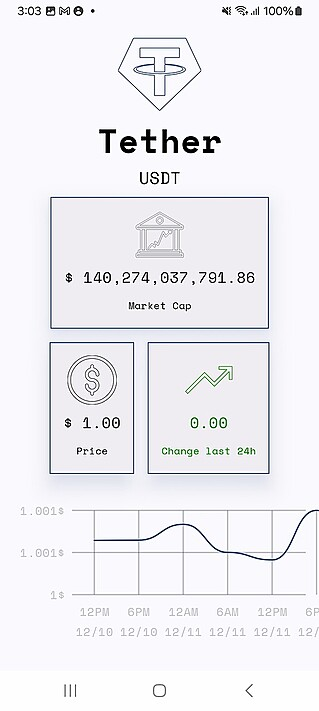

# Cryptocurrency Tracker App 📊

A simple two-screen Android app built using Kotlin and Jetpack Compose that allows users to:
1. View a list of cryptocurrencies on the first screen.
2. See detailed information about a selected cryptocurrency on the second screen, including a price changes line chart.
3. Navigate seamlessly between screens with **adaptive navigation** for a responsive and consistent user experience.

---

## 📸 Screenshots

### Home Screen - Cryptocurrency List

### Details Screen - Price Changes Line Chart

---

## App Video
https://github.com/user-attachments/assets/164b2149-9e8d-4820-935a-a4940b378113

---

## ✨ Features

- **Cryptocurrency List:** Displays a list of top cryptocurrencies with basic details.
- **Details Screen:** Shows detailed information about the selected cryptocurrency, including a dynamic price changes line chart.
- **Data Fetching:** Uses a public cryptocurrency API to fetch real-time data.
- **Modern UI:** Built with Jetpack Compose for a clean and responsive design.

---

## 🛠️ Technologies Used

- **Kotlin**: For building the app.
- **Jetpack Compose**: For creating the UI.
- **Ktor**: For network requests to fetch cryptocurrency data.
- **Coil**: For loading cryptocurrency logos.
- **Adaptive Navigation**: Adaptive navigation for all size of screen.
- **Coroutines**: For asynchronous data fetching.

---
